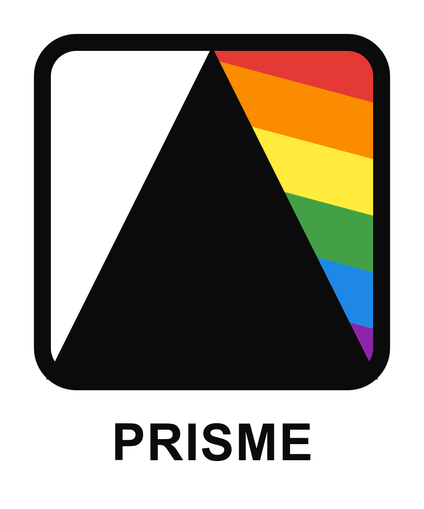

<p align="center">
  
</p>

# Apply Branding GitHub Action

This action applies branding configuration for a specific flavor. It takes a flavor JSON object and applies the corresponding branding elements to your project, streamlining the process of customizing your application for different white-label clients.

**About the SaaS:**

[prime.lucianosantos.dev](https://prime.lucianosantos.dev) is a portal to manage white-label app clients. It helps you organize, configure, and maintain multiple branded versions of your application, streamlining the process of delivering customized apps to different customers.

## Inputs

### `flavor`

**Required** The flavor JSON object containing branding information for the specific client.

### `project-api-key`

**Required** The project API key to fetch additional resources if needed during the branding process.

## Outputs

### `status`

The status of the branding application process.

## Example usage

```yaml
# Apply branding for a specific flavor:
steps:
  - id: apply-branding
    uses: lucianosantosdev/prisme-apply-brand@v1
    with:
      flavor: ${{ matrix.flavor }}
      project-api-key: ${{ secrets.PROJECT_API_KEY }}
  - name: Check branding status
    run: echo "Branding status: ${{ steps.apply-branding.outputs.status }}"
```

## Matrix build example

You can combine this action with the prisme-fetch-flavors-action to create a complete white-label build pipeline:

```yaml
jobs:
  fetch-flavors:
    runs-on: ubuntu-latest
    outputs:
      flavors: ${{ steps.fetch-flavors.outputs.flavors }}
    steps:
      - id: fetch-flavors
        uses: lucianosantosdev/prisme-fetch-flavors-action@v1
        with:
          project-api-key: ${{ secrets.PROJECT_API_KEY }}

  build:
    needs: fetch-flavors
    runs-on: ubuntu-latest
    strategy:
      matrix:
        flavor: ${{ fromJson(needs.fetch-flavors.outputs.flavors) }}
    steps:
      - name: Checkout code
        uses: actions/checkout@v3
      
      - name: Apply branding
        uses: lucianosantosdev/apply-branding-android-native-action@v1
        with:
          flavor: ${{ matrix.flavor }}
          project-api-key: ${{ secrets.PROJECT_API_KEY }}
      
      - name: Build for flavor
        run: |
          echo "Building for flavor: ${{ matrix.flavor.name }}"
          # add your build steps here
```